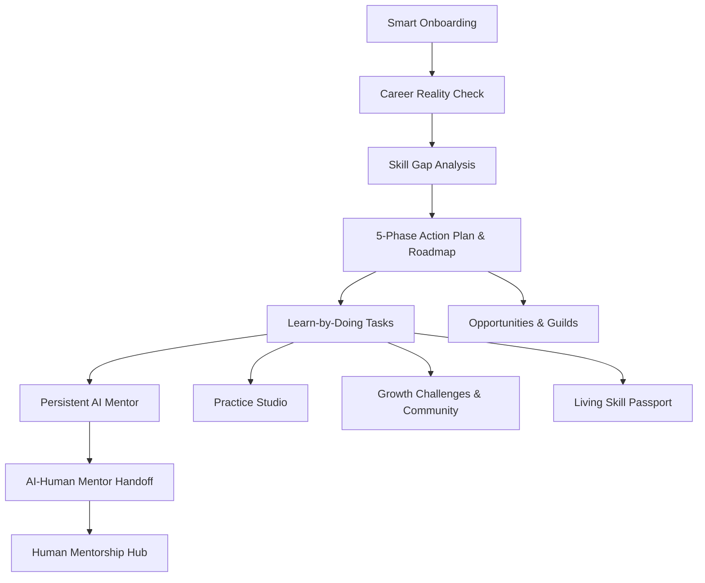

# CAREER SOLVER — AI-Powered Personal Growth, Career Guidance & Mentorship Platform

> **"Turn your career uncertainty into a practical, realistic path forward."**

Career Solver is a complete, functional, realistic, end-to-end MVP. It is designed not as a static landing page or generic chatbot, but as an action-oriented personal growth platform that takes users from *"I don't know what to do"* to *"I know my next step."*

---

## 🌟 The Connected User Journey

Career Solver connects the entire growth lifecycle:



---

## 🚀 Target Personas & Instant 1-Click Evaluation

The platform supports multiple real-world user pathways with respectful, customized guidance. Evaluators can switch personas in 1-click via the top header bar or login screen:

1. **Arun Kumar (College Student)**
   * **Background:** Final-year engineering student (AI & Data Science).
   * **Goal:** Placement-ready for a Java Backend Developer role.
   * **Pre-loaded Experience:** 5-phase roadmap, active REST controller coding task, STAR interview answers, accepted mentor request with a Senior Backend Architect.

2. **Muthu Vel (Practical Experience / Vocational Trades)**
   * **Background:** 3 years practical experience assisting with appliance repair; non-traditional educational background.
   * **Goal:** Certified Electrical & Appliance Service Technician.
   * **Respectful Terminology:** Highlights practical tool mastery, Live-Dead-Live 5-step safety protocols, multimeter diagnostics, and recognized apprenticeship pathways.

3. **Priya Sharma (Working Professional Career Switcher)**
   * **Background:** 3 years in SaaS customer support.
   * **Goal:** Digital Marketing & Growth Specialist.
   * **Transferable Skills:** Customer empathy, pain-point analysis, conversion copywriting, and campaign management.

4. **Career Solver Admin (`admin@careersolver.ai` / `admin123`)**
   * **Capabilities:** System stats, user inspection, community moderation, and demo data re-seeding controls.

---

## 🧩 Core Product Modules Built

| Module | Name | Key Capabilities |
| :--- | :--- | :--- |
| **Module 1** | **Smart Onboarding & Personal Profile** | Adaptive multi-step wizard collecting education, hands-on experience, constraints, and daily hours. |
| **Module 2** | **Career Reality Check** | Honest, non-dogmatic AI evaluation of fit, existing strengths, critical skill gaps, challenges, and alternative pathways with 1-click conversion to roadmap. |
| **Module 3** | **AI Career Navigator** | Conversational career navigation distinguishing user context, industry norms, AI suggestions, and external verification. Bilingual (English & Tamil). |
| **Module 4** | **Pathway Comparison** | Multi-dimensional matrix comparing skills, learning effort, transferable skills, entry barrier, and practical task examples. |
| **Module 5** | **AI Action Plan & Roadmap** | 5-Phase structured progression (Foundation, Skill Development, Practical Projects, Interview Prep, Job Readiness) with weekly schedules and milestones. |
| **Module 6** | **Learn-by-Doing Tasks** | Action-oriented daily exercises with step-by-step instructions, expected outcomes, user submission notes, and instant AI coaching feedback. |
| **Module 7 & 8** | **AI Mentor & Human Handoff** | 6 specialized persistent mentor modes (Career, Study, Job, Skill, Business, Communication). Automatically detects when human expertise is needed and suggests handoff. |
| **Module 9** | **Practice Studio** | Interactive practice (Mock interview, 60-second self-introduction, trade safety protocols) with objective scores (Clarity, Relevance, Structure, Completeness) and model answers. |
| **Module 10** | **Progress Dashboard** | Command center featuring active goal, progress bar, prominent **"Next Best Action"**, today's checklist, and personal streak. |
| **Module 11** | **Skill Passport** | Living profile strictly distinguishing **User Reported**, **Completed Activity**, and **Verified** credentials. |
| **Module 12 & 13** | **Challenges & Community** | 7-day structured sprints (Communication, Java, Trades Safety, Resume Polish) with peer discussions, comments, and moderation reporting. |
| **Module 14 & 15** | **Human Mentorship Hub** | Directory of verified demo mentors with area, experience, language filters, and mentorship request workflow (Pending, Accepted, Declined). |
| **Module 16 & 17** | **Ecosystem & Opportunities** | Sample internships, apprenticeships, and workshops connected to verified demo partner organizations. |
| **Module 18** | **Business & Project Builder** | Lean MVP architect for entrepreneurs: Problem statement, target users, 7-day MVP definition, 4 validation tasks, and high-level cost estimation. |
| **Module 20 & 24** | **Multilingual Foundation** | Instant language toggle supporting English and Tamil (தமிழ்) for navigation, guidance, and AI responses. |

---

## 🛠️ Technology Stack & Architecture

Career Solver was architected for zero-friction setup, persistent data, and deterministic execution:

* **Frontend:** React 18 with Vite, TypeScript, Tailwind CSS, Lucide React icons, and Canvas Confetti.
* **Backend:** Node.js Express server with unified Vite dev middleware (serving API and hot-reloading frontend on a single unified port: `http://localhost:5000`).
* **Database:** Native SQLite powered by Node's built-in `node:sqlite` (`career_solver.db`). Zero external binary compilation dependencies (`node-gyp` free), persistent relational tables, WAL mode, foreign keys, and indexes.
* **Authentication:** Lightweight HMAC-SHA256 JWT tokens using Node's native `crypto` module with password hashing, session persistence, and protected routes.
* **AI Integration:** Google Gemini Generative AI SDK (`@google/generative-ai`) paired with a resilient, domain-specific heuristic fallback engine that guarantees rich, structured output even offline or when an API key is not yet set.

---

## 💻 Running the Application Locally

### Prerequisites
* Node.js v20+ or v22+ (tested on Node v24.13.0)
* npm v10+

### Quick Start in 2 Steps

1. **Install Dependencies & Seed Database:**
   ```bash
   npm install
   npm run seed
   ```

2. **Start the Unified Full-Stack Application:**
   ```bash
   npm run dev
   ```
   Open your browser to:
   ```
   http://localhost:5000
   ```

*(In development, the Express server mounts Vite middleware directly, so both API endpoints at `/api/...` and the React frontend run on port 5000 with instant Hot Module Replacement!)*

### Optional: Configuring Google Gemini API Key
You can add your Google Gemini API key in either of two ways:
1. In `.env`:
   ```env
   GEMINI_API_KEY=your_gemini_api_key_here
   GEMINI_MODEL=gemini-1.5-flash
   ```
2. Or dynamically inside the running app via **Settings (`/settings`)**!
*(Note: If no API key is provided, the platform automatically runs its built-in high-fidelity domain heuristic engine so that all modules function with zero crashes!)*

---

## 🧪 Testing & Verification

Run the comprehensive integration test suite verifying health, authentication, dashboard overview, reality check analysis, roadmap generation, daily tasks, AI mentor chats, and practice studio evaluations:

```bash
node -e "
async function test() {
  const res = await fetch('http://localhost:5000/api/health');
  console.log('Health:', await res.json());
}
test();
"
```

To run a production bundle build:
```bash
npm run build
```

---

## 🛡️ AI Safety, Privacy & Trust Principles

1. **Non-Dogmatic Guidance:** The system never says *"You are guaranteed to succeed"* or *"You cannot do this."* It uses realistic language: *"Based on the information provided..."*, *"This pathway typically requires..."*.
2. **Safety in Practical Trades:** For high-risk practical trades (electrical wiring, mechanical servicing), instructions strictly prioritize personal protective equipment (PPE), insulated tool ratings, and the Live-Dead-Live isolation protocol. Dangerous unsupervised work is discouraged.
3. **Truth in Labeling:** Demo mentors, demo organizations, and sample opportunities are clearly labeled as demo content to prevent deceptive social proof.
4. **Credential Integrity:** The Skill Passport strictly separates self-reported user claims from completed activities and accredited credentials.
